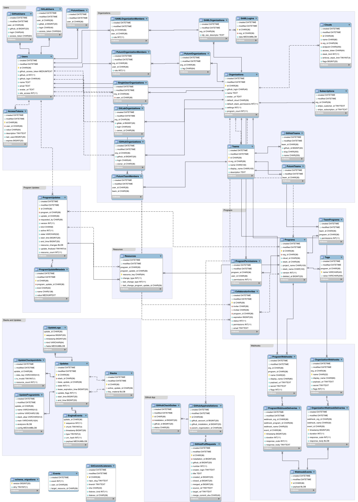
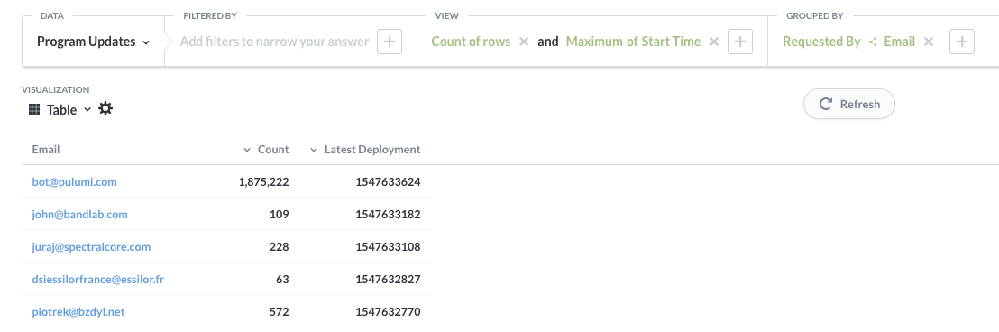
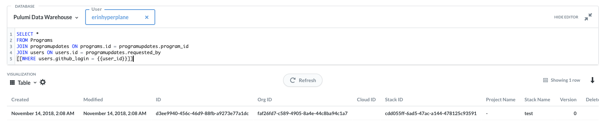

We have a data warehouse and [Metabase](https://metabase.corp.pulumi.com/) front-end for self-service query and analytics as well as general-purpose shared dashboards over our key data stores.

The Metabase front end is available at https://metabase.corp.pulumi.com.  You can login with an `@pulumi.com` Google account.

## Shared Dashboards

There are currently two general purpose dashboards which provide easy access to key shared metrics:

The [Engagement](https://metabase.corp.pulumi.com/dashboard/1) dashboard includes key adoption and engagement metrics.

The [Content](https://metabase.corp.pulumi.com/dashboard/2) dashboard includes key stats on viewership of our content across our web properties.

If there are additional metrics of team-wide interest - they should be added to these shared dashboards.  Anyone can also create their own dashboards for private self-service query use cases.

## Data Sources

There are two data sources currently available - more are planned for the future (ALB Logs, Checkpoint Files).

### Pulumi Production Database 

The Pulumi Service production database is synced nightly (at 10AM UTC), and exposed as the `Pulumi` schema in Redshift/Metabase.  In general, this is the best place to start for queries, as it is the definitive source for most product usage questions.

This schema includes many tables with often complex relationships as it is the unmodified raw production database schema.  The diagram below gives a sense of some of the reationships, and many of the real (and desired) foreign-key relationships in this data are enabled for easy navigation within Metabase.

Particularly useful tables for many analyses:
* `Users`: All registered users
* `Programs`: All stacks (confusingly, there is also a Stacks table, but it is in general less useful, and is linked from the Programs table)
* `ProgramUpdates`: All update operations (update, destroy, preview, etc.)

### Segment

Data sent to our [Segment](https://segment.com/) account is snapshotted regularly into Redshift.  This currently includes the following Schemas:
* `App` (app.pulumi.com frontend Angular app)
* `Blog` (blog.pulumi.com)
* `Info` (not sure...)
* `Io` (pulumi.io docs site)
* `Pulumi Service Backend` (app.pulumi.com backend Go app)
* `Www` (pulumi.com marketing site)

Each table in each of these schemas is an event stream for the named event.  For example `Blog > Pages` is the event stream of blog page views, `Pulumi Service Backend > Stack Destroy` is an event stream of stack destroy events from the Pulumi Service.  The latter is duplicative of data which can also be gathered from the `Pulumi` schema within the database, but may be useful to query via Segment 

## Using Metabase

You can read the [Metabase Getting Started](https://metabase.com/docs/latest/getting-started.html) or just dive in and play around with data in the Pulumi data warehouse.  It is often easiest to find existing queries and incrementally modify them.

There are two kinds of "questions" you can ask in Metabase.

### Custom

These allow a UI-driven way to expore and query data in a table.  They are not quite as flexible (no joins, etc.) but highly productive and easy to create rich visualizations.

For example, the [Most Recent Users](https://metabase.corp.pulumi.com/question/10) query looks like this:

### Native Query
These allow arbitrary SQL against the full set of tables in the datawarehouse.  Any legal query against the the Redshift data warehouse is possible here.  The results of these queries can be used directly, or saved as Saved Queries and then those can be used as the source for a "Custom" query (kind of like a database view, but ony materialized by Metabase, not the database).

For example, the [User Program Updates](https://metabase.corp.pulumi.com/question/12?user_id=erinhyperplane) query looks like this:

